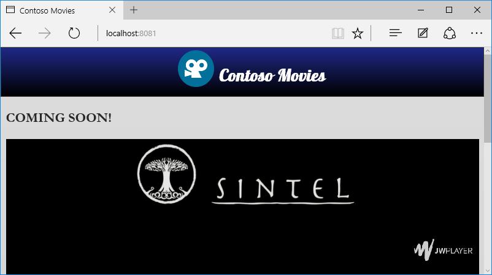

Prefixos CSS
========================================
Neste minicurso iremos corrigir problemas no uso de prefixos CSS. 

Os prefixos CSS são comumente utilizados para o desenvolvedor usufruir de recursos CSS em seu site antes mesmo destes se tornarem [recomendações](http://www.w3.org/Consortium/Process/Process-19991111/tr.html#RecsCR). 

Nesse caso o desenvolvedor assume certos riscos em utilizar recursos que podem vir a não funcionar em alguns browsers, principalmente naqueles que não estão sempre sendo atualizados. Pode ocorrer, por exemplo, de certo conteúdo ser apresentado de forma errada para o usuário em determinadas circunstâncias.

Para minimizar estes problemas, neste minicurso veremos:

1. [Identificando problemas de uso de prefixos CSS](#Task1)
1. [Usando ferramenta de para adicionar prefixos CSS automaticamente](#Task2)
1. [Revisão](#Review)

Para executar as tarefas, vamos baixar o código de [`code\begin`](./code/begin) e então abrir a pasta `"begin"` no **Visual Studio Code** através do `Open Folder`.

Depois disso, para executar vamos pressionar a tecla de atalho `CTRL+SHIFT+B`:


Site aberto a partir de um servidor Web local:



> Você pode usar a ferramenta de desenvolvimento Web que desejar. Acesse a [etapa de configuração](../_setup) deste minicurso para mais detalhes.

<p name="Task1" />
##Identificando problemas de uso de prefixos CSS

Voltando para os resultados obtidos pelo Site scan (realizado no [minicurso 1](../rendermode/)), observe que nossa página `index.html` possui o seguinte problema de prefixo CSS:

````Javascript
"cssprefixes": {
  "testName": "cssprefixes",
  "passed": false,
  "data": [
	{
	  "cssFile": "embed",
      "selectors": [
        {
          "selector": ".fadeIn",
          "lineNumber": 3,
          "styles": [
            "-webkit-animation"
          ]
        }
      ]
    }
  ]
}
````

Para corrigir este problema, recomenda-se especificar o CSS tanto sem prefixo como com prefixos específicos de outros browsers. Exemplo:

````CSS
-webkit-appearance: button; /* WebKit */
   -moz-appearance: button; /* Mozilla */
     -o-appearance: button; /* Opera */
    -ms-appearance: button; /* Internet Explorer */
        appearance: button; /* CSS3 */
````

No nosso caso, vamos localizar o seletor `.fadeIn` onde foi detectado o erro e então incluir as seguintes propriedades:

	.fadeIn {
        -webkit-animation: fadeIn 3s forwards; /* WebKit */
           -moz-animation: fadeIn 3s forwards; /* Mozilla */
             -o-animation: fadeIn 3s forwards; /* Opera */
            -ms-animation: fadeIn 3s forwards; /* Internet Explorer */
                animation: fadeIn 3s forwards;
    }

Percebam que agora incluímos todos os prefixos para animation. Isso dá maiores garantias de que a propriedade funcionará adequadamente nos browsers modernos.

E se testarmos de novo o site após feita essa alteração, você irá notar que o problema encontrado anteriormente não estará mais lá. Somente estarão sendo apontados os problemas nos arquivos externos.
  
<p name="Task2" />
##Usando ferramenta para adicionar prefixos CSS automaticamente

Uma opção interessante é usar ferramentas que adicionam automaticamente os prefixos CSS. Isso facilita o trabalho e reduz risco de erro. Aqui usaremos o autoprefixer disponibilizado no repositório GitHub [https://github.com/postcss/autoprefixer](https://github.com/postcss/autoprefixer).

O Autoprefixer pode executado de várias maneiras, seja por linha de comando, no processo de build ou mesmo através de ferramentas de edição de texto como Visual Studio de SublimeText.

Segue exemplo usando o postcss-cli, ferramenta de linha de comando do [PostCSS](https://github.com/postcss/postcss).
 
1. Instalar via npm o postcss com o plugin autoprefixer através do seguinte comando:

	`npm install --global postcss-cli autoprefixer`

	> npm é o gerenciador de pacotes para nodejs.

2. Ainda usando linha de comando, executar o postcss na pasta onde estão os arquivos CSS que queremos adicionar automaticamente os prefixos CSS:

	postcss --use autoprefixer [nome_arquivo].css -d .

> O argumento `-d` permite especificar a pasta de saída. Neste caso estamos atualizando o mesmo arquivo. Mas podem ter situações em que queremos gerar o arquivo sem sobrescrever o atual. Neste caso especificamos como valor do argumento `-d` uma pasta já existente. 
	
Ainda podemos especificar as versões de browsers quando for feita a inclusão dos prefixos CSS. Exemplos:

- Ultimas 2 versões dos principais browsers do mercado: `"last 2 versions"`.
- Borwsers com mais de 1% de uso global: `"> 1%"`.
- Somente as ultimas versões de um determinado browser `"ie > 9"` ou `"ie >= 9"`.

Para tanto, incluímos o argumento `--autoprefixer.browsers`. Exemplo:

`postcss --use autoprefixer --autoprefixer.browsers "last 2 versions" [nome_arquivo].css -d .`

Pronto! Agora é para os prefixos estarem adicionados corretamente.

<p name="Review"/>
##Conclusão

Você pode obter o código final desse minicurso [aqui](./code/end).

Leituras Recomendadas:

1. [Prefixos CSS no Microsoft Edge](http://talkitbr.com/2015/08/19/prefixos-css-no-microsoft-edge/): Aprenda a usar Prefixos CSS;
2. [Teste seu site em diferentes versões de browsers](http://talkitbr.com/2015/09/01/teste-seu-site-em-diferentes-versoes-de-browsers/): Veja como testar seu site em diferentes versões de browsers, desde o IE até Chrome e Firefox. 

[Voltar para a página inicial.](http://joaocunhaeld.github.io/interoperable-web-development)