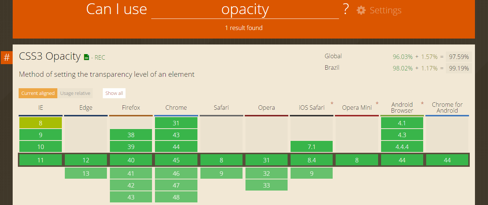
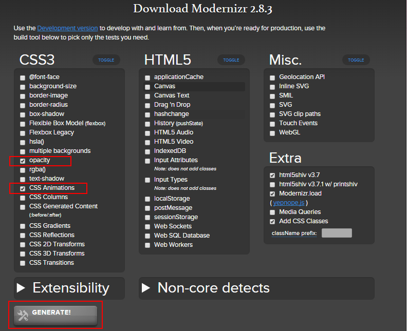
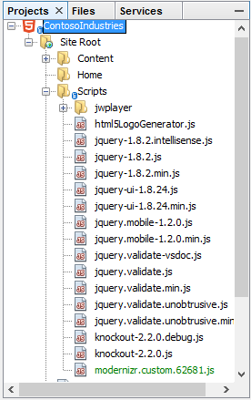
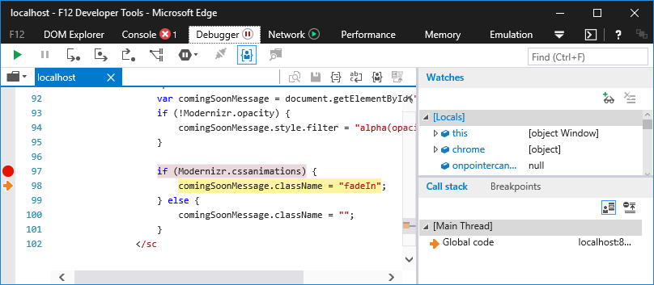
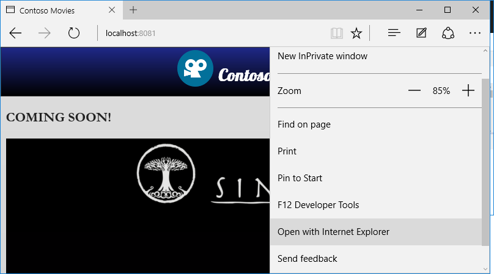
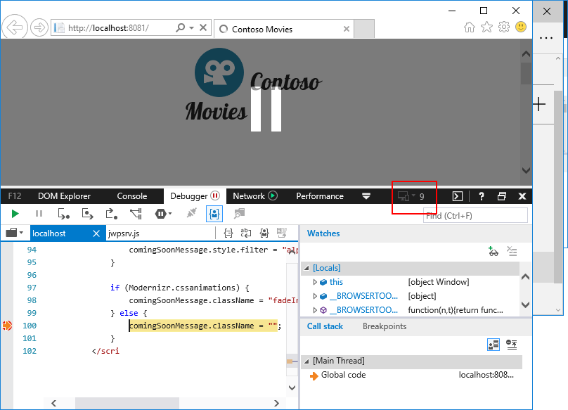

Detecção de Features
========================================
Neste minicurso iremos ver como usar detecção de features para determinar se determinado recurso é suportado pelo navegador web do usuário antes de usá-lo. Isso é necessário pois existem alguns recursos que podem não estar disponíveis no navegador que o usuário está utilizando. Como não podemos e nem devemos forçar o usuário a ter um único navegador, temos que saber contornar as situações em que determinado recurso simplesmente não é suportado pelo browser do usuário.

Neste minicurso temos:

1. [Identificando e substituindo detecção de browser](#Task1)
1. [Revisão](#Review)

Atualmente existem muitas páginas que fazem detecção de browser (chamado também de user agent detection) e até de versões de browser para determinar se um dado recurso pode ser usado ou não. Porém isso não é recomendado. As boas práticas de Web Moderna pedem para que se use detecção de features.

Para executar as tarefas, vamos baixar o código de [`code\begin`](./code/begin) e então abrir a pasta `"begin"` no **Visual Studio Code** através do `Open Folder`.

Depois disso, para executar vamos pressionar a tecla de atalho `CTRL+SHIFT+B`:


Site aberto a partir de um servidor Web local:


> Você pode usar a ferramenta de desenvolvimento Web que desejar. Acesse a [etapa de configuração](../_setup) deste minicurso para mais detalhes.

<p name="Task1" />
##Identificando e substituindo detecção de browser

Voltando para os resultados obtidos pelo Site scan (realizado no [minicurso 1](../rendermode/)), observe que nossa página `index.html` faz uso de detecção de browser em dois pontos:

````Javascript
"browserDetection": {
  "testName": "browserDetection",
  "passed": false,
  "data": {
    "javascript": {
      "passed": false,
      "data": [
        {
          "passed": false,
          "pattern": "navigator.userAgent",
          "lineNumber": 5,
          "url": "embed"
        },
        {
          "passed": false,
          "pattern": "navigator.userAgent",
          "lineNumber": 11,
          "url": "./Scripts/jwplayer/jwplayer.js"
        }
      ]
    },
    "comments": {
      "passed": true
    }
  }
}
````

Um dos pontos detectados está no nosso código HTML. O outro foi detectado no uso da biblioteca JS jwplayer. Aqui vamos focar no nosso código HTML. 

Voltando para o código, vamos localizar os pontos que fazem uso de detecção de browser. Vamos iniciar abrindo o arquivo `index.html`. Nele encontraremos o seguinte trecho de código javascript:

````Javascript
<script>
    var comingSoonMessage = document.getElementById("hidden-message");

    function isValidBrowser() {
        var myNav = navigator.userAgent.toLowerCase();
        var version;

        if (myNav.indexOf('msie') != -1) {
            version = parseInt(myNav.split('msie')[1])
            return version > 8;
        }

        return true;
    }

    if (isValidBrowser()) {
        comingSoonMessage.className = "fadeIn";
    } else {
        comingSoonMessage.className = "";
    }
</script>
````	

Observem que estamos verificando se o browser é o Internet Explorer para determinar se podemos ou não usar o recurso "fadeIn". Porém, do jeito que foi implementado, os usuários nunca conseguirão ter acesso a esse recurso no IE mesmo que o browser passe a suportar esse recurso numa versão mais nova. Esse é apenas um caso, mas existem muitos outros.

Outro recurso também que pode não existir em browsers antigos é a propriedade CSS `opacity`. Para verificar o que cada browser suporta, acesse o site [CanIUse](http://caniuse.com/):



Para verificarmos o suporte a esses recursos e features, o correto é utilizarmos  *feature detection*. E existem bibliotecas que podemos usar, como por exemplo o Modernizr.

1. Vamos começar removendo a tag script que contem o Javascript que faz detecção de browser. 
2. Feito isso,  acessar o site [http://modernizr.com/download/](http://modernizr.com/download/)
3. Nesse site selecionamos os recursos que queremos. Como o recurso a ser verificado é especificamente a animação CSS3 "fadeIn" e o opacity, vamos selecionar apenas a detecção as features `CSS Animations` e `CSS Opacity`:

	 

	> Selecionar apenas as features necessárias ajuda a melhorar o desempenho do seu site.  

3. Fazer download da opção Build e colocar o arquivo na pasta Scripts do projeto (para acessar o Explorer, basta selecionar a pasta Scripts e no menu de contexto selecionar o item *Reveal in Explorer*):

	

4. Agora vamos incluir esse script na nossa página index.html. Vamos incluir no final da tag `head`:
		
    ````HTML
	<script src="Scripts/modernizr-custom" type="text/javascript"></script>
    ````

> Feito isso, ao abrirmos a página no navegador Web, o Modernizr irá verificar o suporte para as features que selecionamos a pouco. No nosso caso, a feature será CSS Transitions.
	 
7. Vamos agora remover o script que faz detecção de browser e incluir o script abaixo que faz detecção das features "Animations" e "Opacity" usando informações disponibilizadas pelo script do Modernizr:

	````HTML
	<script>
	     var comingSoonMessage = document.getElementById("hidden-message");
	     if (!Modernizr.opacity) {                  
	          comingSoonMessage.style.filter = "alpha(opacity=0)";
	     }
             
         if (Modernizr.cssanimations) {
	          comingSoonMessage.className = "fadeIn";
	     } else {
	          comingSoonMessage.className = "";
	     }
	</script>
	````
	
8. Agora vamos testar nosso site no Edge e demais browsers (usar tecla de atalho `CTRL_SHIFT+B`). Usando a ferramenta do Desenvolvedor (F12), observamos que é possível verificar o funcionamento do nosso código:

	

9. Pelo próprio Edge podemos abrir o site também no Internet Explorer. Para tanto, clicar no menu do Edge e selecionar o item "Open with Internet Explorer":

	

11. No IE conseguimos testar o site emulando diferentes versões do browser através da Ferramenta do Desenvolvedor (aba Emulation):

	

	> Observe na imagem acima que estamos fazendo depuração do código emulando o IE9. No caso IE9 ou anterior irão acusar ausencia dos recursos opacity e cssanimations. 

Pronto! Se analisarmos novamente nosso site pelo Site Scan, você observará que o item de browserDetection da nossa página não estará mais lá. Somente constará o uso na biblioteca JS jwplayer:

````Javascript
"browserDetection": {
  "testName": "browserDetection",
  "passed": false,
  "data": {
    "javascript": {
      "passed": false,
      "data": [
        {
          "passed": false,
          "pattern": "navigator.userAgent",
          "lineNumber": 11,
          "url": "./Scripts/jwplayer/jwplayer.js"
        }
      ]
    },
    "comments": {
      "passed": true
    }
  }
}
````
  
<p name="Review"/>
##Conclusão

Aqui vimos como corrigir o site removendo detecção de browser. Você pode obter o código final desse minicurso [aqui](./code/end).

Leituras Recomendadas:

1. [Criando sites que simplesmente funcionam.](http://talkitbr.com/2015/08/27/criando-sites-que-simplesmente-funcionam/): Veja como usar detecção de features ao invés de detecção de browsers;
2. [Por dentro das novas funcionalidades dos browsers](http://talkitbr.com/2015/08/17/fique-por-dentro-das-novas-funcionalidades-dos-navegadores-web/): Veja como descobrir as novas funcionalidades implementadas pelos browsers.

[Voltar para a página inicial.](http://joaocunhaeld.github.io/interoperable-web-development)