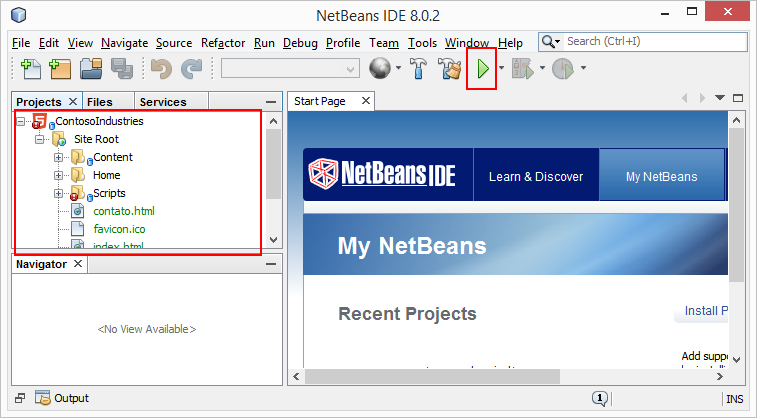
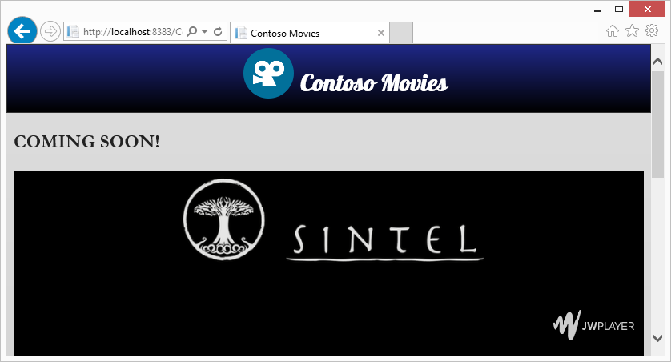
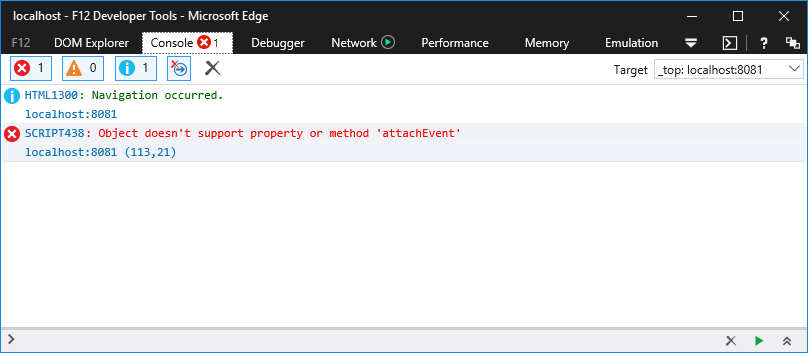

Modo de Renderização e Uso de Funções Obsoletas
========================================
Neste minicurso iremos ver como analisar um site e identificar problemas de codificação que prejudicam a visualização do site em browsers modernos.

Dentre eles citamos o não uso de DOCTYPE e o uso de document modes legados do Internet Explorer. Isso prejudica a visualização do site nas versões mais recentes do IE.

Este minicurso está divido nas seguintes tarefas:

1. [Definição do DOCTYPE](#Task1)
1. [Tratando uso de funções obsoletas](#Task2)
1. [Revisão](#Review)

Para executar as tarefas, vamos abrir o projeto Web. Para tanto, vamos usar o **Netbeans** e acessar a pasta [`code\begin`](./code/begin) contido no repositório.

Depois disso, execute o projeto num servidor Web local usando o próprio **Netbeans**:



Site aberto a partir de um servidor Web local:



<p name="Task1" />
##DOCTYPE e Rendering Mode

Apesar de não ser apontado como problema pelo Site Scan, é uma boa prática definir o DOCTYPE. Como estamos lidando com Web Moderna, vamos incluir o DOCTYPE para HTML5 adicionando o trecho abaixo na primeira linha da nossa página.

	<!DOCTYPE html>

Feito isso, vamos passar a analisar os problemas identificados pelo Site Scan. O primeiro deles é o Rendering Mode:

	"rendermode": {
      "testName": "rendermode",
      "passed": false,
      "data": {
        "source": "tag",
        "mode": "ie=10"
      }
    }

Perceba que além de não passar no teste, o modo de renderização é está definido para o IE10 devido a tag meta `X-UA-Compatible`.

> O Microsoft Edge não leva em consideração a tag meta `X-UA-Compatible`. Mas ela é usada pelo IE. 

Podemos agora remover a tag meta `X-UA-Compatible`, para que o IE mostre nosso site usando o modo de renderização Edge, ou ainda alterar o valor do atributo content para "IE=Edge":

	<meta charset="utf-8" />
	<title>Contoso Movies</title>
	<meta name="viewport" content="width=device-width" />	
	
	<meta http-equiv="X-UA-Compatible" content="IE=Edge" />        
	<link href="./favicon.ico" rel="shortcut icon" type="image/x-icon" />
        
Se executarmos novamente o Site Scan, perceba que a issue "RenderMode" não está mais lá.

	"rendermode": {
      "testName": "rendermode",
      "passed": true,
      "data": {
        "lineNumber": 1,
        "mode": [
          "html5"
        ]
      }
    }

<p name="Task2" />
##Tratando uso de funções obsoletas

Uma vez atualizado o documento, devemos também observar se o mesmo faz uso de recursos disponíveis nos browsers.

> A função attachEvent era usada para definir código a ser executado quando ocorrer um determinado evento. O attachEvent, tornou-se obsoleto e foi totalmente removido do IE11. Além disso ele não existe em nenhum dos browsers modernos, como Microsoft Edge e Google Chrome.  As you can see, the error surfaces now that the app is running in Edge.

Após o passo 1, se executarmos nosso site iremos observar que ocorre um erro Javascript (visualizado através da ferramenta do desenvolvedor F12) relacionado com o uso da função `attachEvent`:



> Esse é um exemplo clássico de problema Javascript quando estamos atualizando sites. A função `attachEvent` foi substituida pela função `addEventListener`. Mas é muito comum encontrá-la nas páginas Web que foram desenvolvidas para versões anteriores do Internet Explorer. Quando usamos um browser moderno ou a nova versão do IE11, o código Javascript simplesmente falha ao tentar executar essa função.

Para corrigir, vamos nesse momento somente alterar o Javascript para usar a função `addEventListener`. Mas não se preocupem, ainda retornaremos neste código em um outro minicurso. 

Vamos abrir a página `index.html` e alterar o código da tag script localizado no final da tag `div` com id `mainContent`:

- De:
	````Javascript
	<script>
        window.attachEvent("load", function () {
            setTimeout(function () {
                jwplayer().play(true);
            }, 500);
        });
    </script>
	````

- Para:
	````Javascript
	<script>
        window.addEventListener("load", function () {
            setTimeout(function () { jwplayer().play(true); }, 500);
        });
	</script>
	````

Dessa forma, conseguiremos obter o resultado esperado no IE11 e nos demais browsers modernos.

<p name="Review"/>
##Conclusão

Neste minicurso fizemos a correção do problema de renderização apontado pelo Site scan. 

Também corrigimos o Javascript que estava usando uma função obsoleta e que não é mais suportada nem no IE11 nem no Microsoft Edge e Google Chrome. 

Você pode obter o código final desse minicurso [aqui](./code/end).