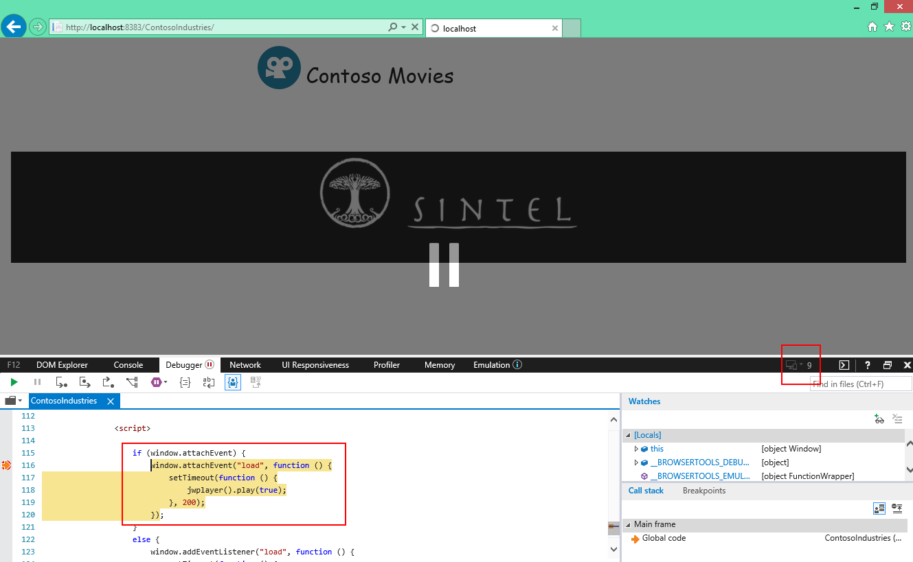

Análise do Site e Modo de Renderização
========================================
Neste minicurso iremos ver como analisar um site e identificar problemas de codificação que prejudicam a visualização do site em browsers modernos.

Dentre eles citamos o não uso de DOCTYPE e o uso de document modes legados do Internet Explorer. Outro problema comum é uso de recursos que funcionam em versões antigas do Internet Explorer e que precisam ser atualizados para funcionar nos browsers modernos.

Este minicurso está divido nas seguintes tarefas:

1. [Analisando o site](#Task1)
1. [Definição do DOCTYPE](#Task2)
1. [Tratando uso de funções obsoletas](#Task3)
1. [Revisão](#Review)

Para executar as tarefas, vamos abrir o projeto Web. Para tanto, vamos usar o **Netbeans** e acessar a pasta [`code\begin`](./code/begin) contido no repositório.

Depois disso, execute o projeto num servidor Web local usando o próprio **Netbeans**:

Site aberto a partir de um servidor Web local:

##Analisando o site

Antes de iniciarmos qualquer atualização do site, precisamos saber como ele está no momento. Pra isso vamos usar a ferramenta Site scan disponibilizada pela Microsoft.

> Se o seu site está na Web, podemos prosseguir com o Site Scan disponível em [dev.modern.ie](http://dev.modern.ie/tools/staticscan/). No caso deste minicurso, o site está local e então vamos usar o Site scan local. Caso você não tenha o Site scan ou não saiba como rodá-lo, rever os passos descritos na etapa de configuração dos minicursos.

Ao abrir a página do Site scan, entrar com a URL do site: 

Clicar no botão Scan: 

Clicar no botão Create Report: 

O relatório será enviado para o site dev.modern.ie para exibir os resultados. Você tem a opção de visualizar localmente os resultados através do conteúdo JSON gerado.

> Até o momento de escrita desde documento, o recurso "Create Report" não estava funcionando. Já há [falha documentada no repositório Git do SiteScan](https://github.com/MicrosoftEdge/static-code-scan/issues/96). Se ainda não estiver corrigido quando você executar este minicurso, a análise deverá ser feita localmente. Para tanto, clicar em "See what will be submitted" para obter o JSON. O Notepad++ disponibiliza um [plugin para visualizar o JSON](http://sourceforge.net/projects/nppjsonviewer/):
> 

##DOCTYPE e Rendering Mode

Apesar de não ser apontado como problema pelo Site Scan, é uma boa prática definir o DOCTYPE. Como estamos lidando com Web Moderna, vamos incluir o DOCTYPE para HTML5 adicionando o trecho abaixo na primeira linha da nossa página.

	`<!DOCTYPE html>`

Feito isso, vamos passar a analisar os problemas identificados pelo Site Scan. O primeiro deles é o Rendering Mode:

	`"rendermode": {
      "testName": "rendermode",
      "passed": false,
      "data": {
        "source": "tag",
        "mode": "ie=10"
      }
    }`

Perceba que além de não passar no teste, o modo de renderização é está definido para o IE10 devido a tag meta `X-UA-Compatible`.

> O Microsoft Edge não leva em consideração a tag meta `X-UA-Compatible`. Mas ela é usada pelo IE. 

Podemos agora remover a tag meta `X-UA-Compatible`, para que o IE mostre nosso site usando o modo de renderização Edge, ou ainda alterar o valor do atributo content para "IE=Edge":

	`<meta charset="utf-8" />
	<title>Contoso Movies</title>
	<meta name="viewport" content="width=device-width" />	
	
	<meta http-equiv="X-UA-Compatible" content="IE=Edge" />        
	<link href="./favicon.ico" rel="shortcut icon" type="image/x-icon" />`
        
Se executarmos novamente o Site Scan, perceba que a issue "RenderMode" não está mais lá.

	"rendermode": {
      "testName": "rendermode",
      "passed": true,
      "data": {
        "lineNumber": 1,
        "mode": [
          "html5"
        ]
      }
    }

##Tratando uso de funções obsoletas

Uma vez atualizado o documento, devemos também observar se o mesmo faz uso de recursos disponíveis nos browsers.

> A função attachEvent era usada para definir código a ser executado quando ocorrer um determinado evento. O attachEvent, tornou-se obsoleto e foi totalmente removido do IE11. Além disso ele não existe em nenhum dos browsers modernos, como Microsoft Edge e Google Chrome.  As you can see, the error surfaces now that the app is running in Edge.

Após o passo 1, se executarmos nosso site iremos observar que ocorre um erro Javascript (visualizado através da ferramenta do desenvolvedor F12) relacionado com o uso da função `attachEvent`:

> Esse é um exemplo clássico de problema Javascript quando estamos atualizando sites. A função `attachEvent` foi substituida pela função `addEventListener`. Mas é muito comum encontrá-la nas páginas Web que foram desenvolvidas para versões anteriores do Internet Explorer. Quando usamos um browser moderno ou a nova versão do IE11, o código Javascript simplesmente falha ao tentar executar essa função.

Para corrigir, devemos alterar o código Javascript para verificar se a função attachEvent está disponível. Na página `index.html`, vamos alterar o código da tag script localizado no final da tag `div` com id `mainContent`:

	

Dessa forma, conseguiremos obter o resultado esperado em todos os casos, mesmo quando o usuário estiver usando um browser anterior do Internet Explorer que implementa somente a função `attachEvent`.

Para testar numa versão anterior do IE, vamos fazer o seguinte:

1. Abrir o Internet Explorer
2. Acessar nosso site
3. Abrir a ferramenta do desenvolvedor
4. Acessar a aba Emulation
5. Selecionar o Document Mode IE9, por exemplo.
6. Na aba Debugger, colocar um ponto de parada dentro do bloco condicional que verifica a existência da função `attachEvent`:

> Observe que o código de `attachEvent` foi executado quando definimos o Document Mode para IE9.

Ainda em relação ao addEventListener, temos outros trechos de código que são usam ele e não o `attachEvent`. E isso pode ser também um problema pois o usuário pode estar usando um browser antigo. Neste caso podemos verificar se a função addEventListener existe antes de utilizarmos ela. Por exemplo:  

	

> O evento `mobileinit` é disparado a partir de navegadores web de smartphones e estes não possuem versões anteriores de navegadores Web, como o IE8. Portanto, nesse caso não precisamos considerar o uso da função `attachEvent`.

Agora vamos rever as demais páginas do site localizando trechos de código que usam a função `addEventListener` para incluir a alteração acima.
  

##Conclusão

Neste minicurso fizemos a análise do nosso site e corrigimos o problema de renderização. 

Também corrigimos o Javascript que estava usando uma função obsoleta e que não é mais suportada nem no IE11 nem no Microsoft Edge e Google Chrome.

Você pode obter o código final desse minicurso [aqui](./code/end).