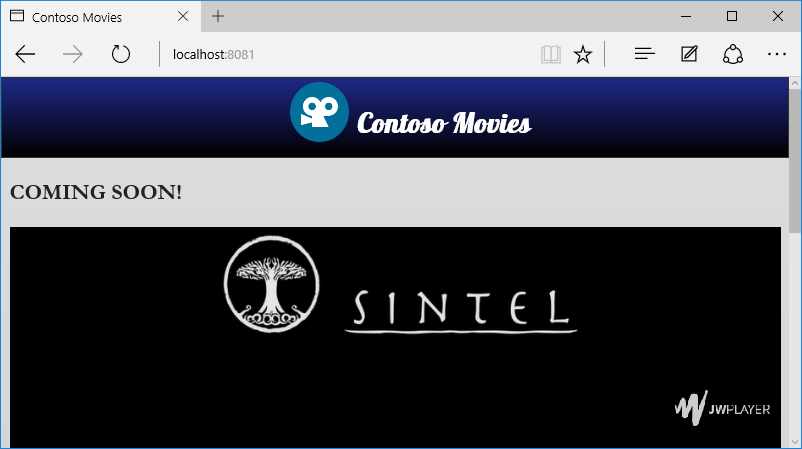
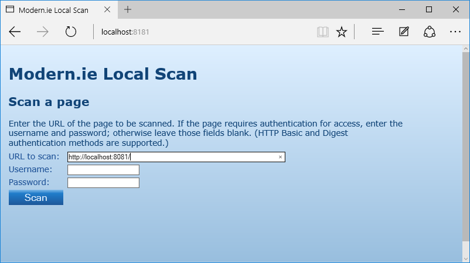
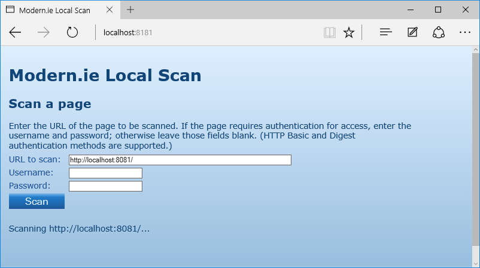

Análisando o Site
========================================
Neste minicurso iremos ver como analisar um site localmente para identificar problemas de codificação que prejudicam a visualização do site em browsers modernos.

Para tanto, vamos abrir o projeto Web. Para tanto, vamos usar o **Netbeans** e acessar a pasta [`code\begin`](./code/begin) contido no repositório.

Depois disso, execute o projeto num servidor Web local usando o próprio **Netbeans**:

Site aberto a partir de um servidor Web local:

##Analisando o site

Antes de iniciarmos qualquer atualização do site, precisamos saber como ele está no momento. Pra isso vamos usar a ferramenta Site scan disponibilizada pela Microsoft.

Além disso, a toda alteração, precisamos verificar se há novos problemas no site.

> Se o seu site está na Web, podemos prosseguir com o Site Scan disponível em [dev.modern.ie](http://dev.modern.ie/tools/staticscan/). No caso deste minicurso, o site está local e então vamos usar o Site scan local. Caso você não tenha o Site scan ou não saiba como rodá-lo, rever os passos descritos na [etapa de configuração dos minicursos](..\_setup).

Ao abrir a página do Site scan local, forneça a URL do site publicado localmente: 

Clicar no botão Scan: 

Clicar no botão Create Report: 

O relatório será enviado para o site dev.modern.ie para exibir os resultados. Você tem a opção de visualizar localmente os resultados através do conteúdo JSON gerado.

> Até o momento de escrita desde documento, o recurso "Create Report" não estava funcionando. Já há [falha documentada no repositório Git do SiteScan](https://github.com/MicrosoftEdge/static-code-scan/issues/96). Se ainda não estiver corrigido quando você executar este minicurso, a análise deverá ser feita localmente. Para tanto, clicar em "See what will be submitted" para obter o JSON. O Notepad++ disponibiliza um [plugin para visualizar o JSON](http://sourceforge.net/projects/nppjsonviewer/):
> 

##Conclusão

Neste minicurso fizemos a análise do nosso site para detectar problemas.

Volte sempre que necessário para este minicurso para relembrar como fazer a análise do seu site localmente.

Lembre-se sempre de verificar a evolução do seu site e correção dos problemas apontados pela ferramenta.

[Voltar para a página inicial.](../)