Testando em diferentes Browsers
========================================
Os testes são uma etapa importante no desenvolvimento de qualquer aplicação, inclusive sites Web. Antes de lançar um site para o público alvo, deve-se realizar testes que envolvem verificar como diferentes versões de browsers em diferentes sistemas operacionais exibem nosso site.

É verdade afirmar que o custo para se ter ambientes de testes com os vários browsers pode ser impeditivo para a maioria das empresas. Contudo veremos neste minicurso como mitigar esse problema e conseguir testar nosso site de forma satisfatória.

Este minicurso contempla:

1. [Ferramentas de Teste](#Task1)
1. [Ferramentas do dev.modern.ie](#Task2)
1. [Testando o site com BrowserStack](#Task3)

<p name="Task1" />
## Ferramentas de Teste ##

A Microsoft disponibiliza, através do site [dev.modern.ie](http://dev.modern.ie/tools/), ferramentas para realizar testes no nosso site. 

Uma dessas ferramentas é o [Site scan](http://dev.modern.ie/tools/staticscan/) que já utilizamos nos minicursos anteriores. Aqui utilizamos essa ferramenta localmente para analisar nosso site.

As ferramentas disponibilizadas pela Microsoft no site dev.modern.ie são:

- **[Virtual Machines:](http://dev.modern.ie/tools/vms/)** Permite selecionar máquinas virtuais Windows que contém o Internet Explorer das versões 6 a 11. Você consegue baixar essas maquinas vertuais e usá-las em tanto no Windows como no sistema operacional do Mac e no Linux. Disponível para Max OS X, Windows e Linux.
- **[Remote IE:](https://remote.modern.ie/)** Você fará um acesso remoto a uma máquina virtual continua no Microsoft Azure e então ter acesso a última versão do Internet Explorer. Disponível para Mac OS X, iOS, Android e Windows.
- **[Site Scan](http://dev.modern.ie/tools/staticscan/)**: Já abordado aqui, permite fazer análise estática do site e identificar possíveis problemas. 
- **[Browser screenshots](http://dev.modern.ie/tools/screenshots/)**: Permite obter um screenshot do site em diferentes browsers de vários sistemas operacionais.
- **[F12 Dev Tools](http://dev.modern.ie/platform/documentation/f12-devtools-guide/)**: Quando estiver exibindo a página no navegador, clicando a tecla F12 permite visualizar informações do site como o código, detalhes de scripts e console com mensagens de aviso/erro, comunicação entre browser e servidor web, entre outros.

Com exceção do Site Scan, em que podemos baixar a ferramenta para fazer análise do nosso site localmente, todas as outras ferramentas requerem que seu site esteja disponível na Web.

E além do dev.modern.ie, temos a possibilidade de testar através dos diferentes browsers disponibilizados pelo BrowserStack.

A seguir iremos abordar cada um dessas ferramentas.

<p name="Task2" />
## Ferramentas do dev.modern.ie

### Usando Virtual Machines

Através das máquinas virtuais, conseguimos obter diferentes versões do Internet Explorer para vários sistemas operacionais Windows.
   
Vamos começar acessando o [site que contém a ferramenta de teste Virtual Machines](http://dev.modern.ie/tools/vms/windows/). Depois disso:

1. Selecionar o Sistema Operacional onde você fará o teste.
2. Selecionar a máquina virtual que você deseja testar.
3. Selecionar a plataforma de virtualização que você possui.

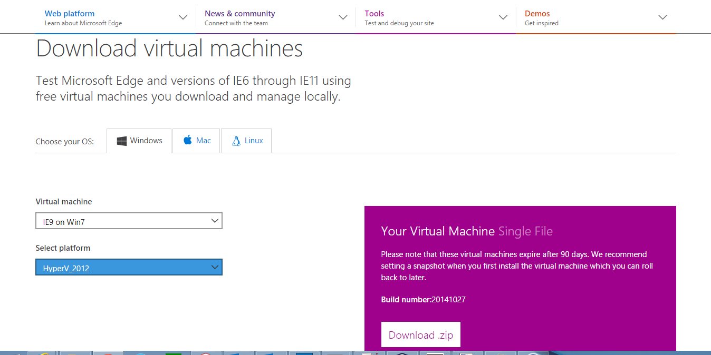

Após baixar a máquina virtual, abri-la usando a plataforma de virtualização desejada. Voc~e terá uma máquina virtual com o browser Internet Explorer para testar seu site.

### Usando RemoteIE

O Remote IE permite obter a última versão do Internet Explorer disponível numa máquina virual disponibilizada pelo Microsoft Azure. Para tanto, você deve ter uma conta Microsoft. 

Para tanto, vamos acessar o [site do RemoteIE](https://remote.modern.ie/) e fazer login usando uma conta Microsoft. A partir daqui, o próprio site disponibiliza um passo a passo para acessar a máquina virtual. Seguem os passos:

1. Selecionar o local onde iremos acessar a máquina virtual. Optar por uma localidade mais próxima da sua região.
2. Na próxima etapa vamos baixar a ferramenta de acesso Remote Desktop. Para tanto, vamos baixar aquela que corresponde ao sistema operacional que estamos usando para fazer acesso remoto. A Microsoft disponibiliza a ferramenta para Mac, iPhone, iPad, Android, Windows Phone 8.1, Windows x86, Windows x64 e Windows RT.
3. Baixada a ferramenta, vamos executá-la. Será estabelecida a comunicação com a máquina virtual.
4. Será solicitada a conta Microsoft para acesso. Forneça a mesma que você usou inicialmente para iniciar este processo.
5. Ao entrar na ferramenta, você terá acesso a última versão Internet Explorer disponibilizado pela Microsoft.
6. Por fim, fornecer a URL para testes e verificar como o site se comporta no IE. 

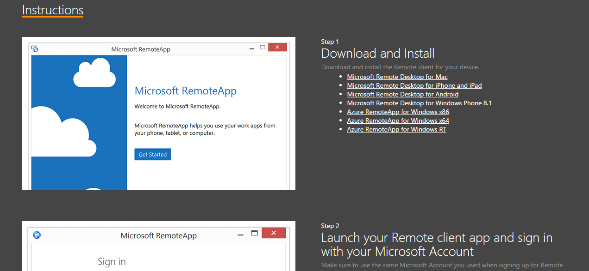

### Usando Site Scan

O Site scan permite realizar a análise estática do site, detectando possíveis problemas no código HTML, CSS e Javascript. Já vimos nos minicursos anteriores o uso do Site scan localmente.

Mas o site da Microsoft disponibiliza também essa ferramenta e também fornece dicas e sugestões para correção dos erros apontados. Para tanto, basta que seu site esteja disponível na Web.

O Site scan analisa o seu site nas seguintes áreas:

- Interoperabilidade na Modern Web
- Experiência em diferentes browsers
- Features Windows 

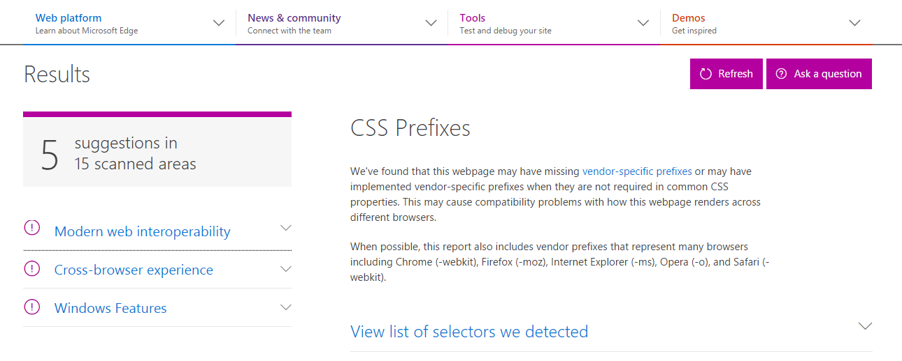

### Usando Capturas de Tela de Browsers

Outra opção é obter uma captura de tela do nosso site em diferentes browsers de diferentes navegadores Web. Pode ser útil para identificar possíveis problemas de visualização do site em alguns browsers. As capturas de tela são obtidas através do [BrowserStack](https://www.browserstack.com/), parceiro da Microsoft. 

1. Acessar o site [Browser Screenshots](http://dev.modern.ie/tools/screenshots/).
2. Fornecer a URL do seu site ou página dentro do seu site que você deseja avaliar.
3. Depois de um tempo, serão exibidas as telas obtidas.

Segue exemplo de resultado obtido para o site [GitHub.com](http://github.com)

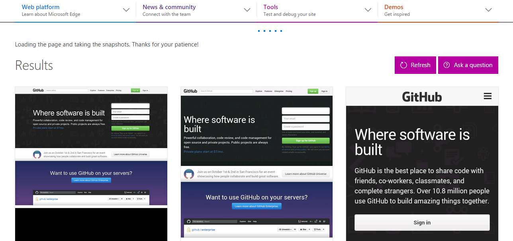

### Usando ferramenta F12

Todos os browsers dispõem de uma ferramenta de desenvolvimento que permite visualizar detalhes da página além da comunicação entre o browser e o servidor Web. Para acessar essa ferramenta basta abrir um site no browser e então pressionar a tecla F12 quando o browser estiver em ativo e em foco.


A seguir iremos abordar em separado cada aba.

- **DOM Explorer**

	Permite visualizar o conteúdo HTML da página e também selecionar trechos de código para identificá-los no site ou vice-versa. Além disso, é possível visualizar, para um determinado elemento selecionado na página ou código, o CSS aplicado, os eventos Javascript associados além de informações de Layout: 
	
	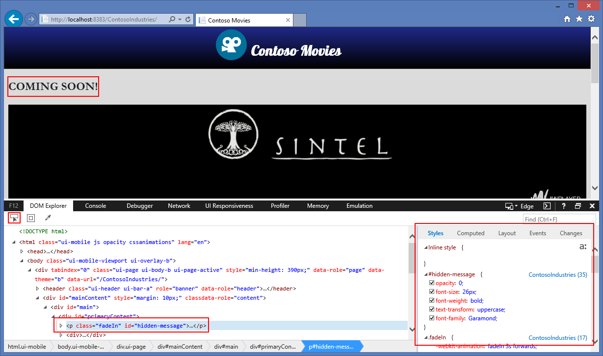
	
	> Na imagem acima é possível visualizar que temos em destaque o conteúdo HTML que exibe a mensagem "Comming Soon" e, ao lado, os estilos CSS nele aplicados.
	
	#### Console
	
	Permite executar comandos Javascript e também verificar possíveis problemas notificados pelo browser ao abrir a página. No exemplo a seguir, executamos os seguintes comandos Javascript:

	````Javascript
	document.compatMode
	document.getElementById("hidden-message").innerHTML = "Em Breve!"
	````

	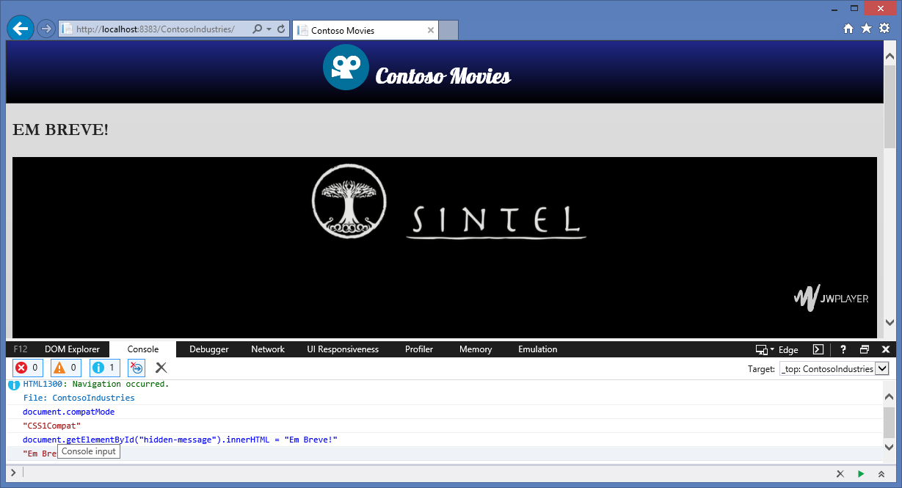

- **Debugger**

	É possível através do debugger adicionar pontos de parada no Javascript para que você execute o código linha a linha. 

	Ao selecionar a aba Debugger, você verá os arquivos que contém Javascript. Nele, encontrar a linha onde deseja interromper a execução (ponto de parada) e então executar o site para que o browser interrompa a execução do Javascript naquela linha.

	

	> Exemplo de ponto de parada definido no curso de modo de renderização.

- **Network**

	Permite avaliar comunicação entre browser e servidor Web. É especialmente útil para identificar gargalos no site que podem prejudicar o tempo de carregamento do mesmo no browser do usuário.

	Ali você também consegue verificar todas as requisições feitas e respostas obtidas. Para as respostas é possível identificar também aquelas que falharam.

	No caso do Internet Explorer, para verificar, basta selecionar a aba Network, habilitar o monitoramento (botão ) e então abrir no browser a página que desejar.

	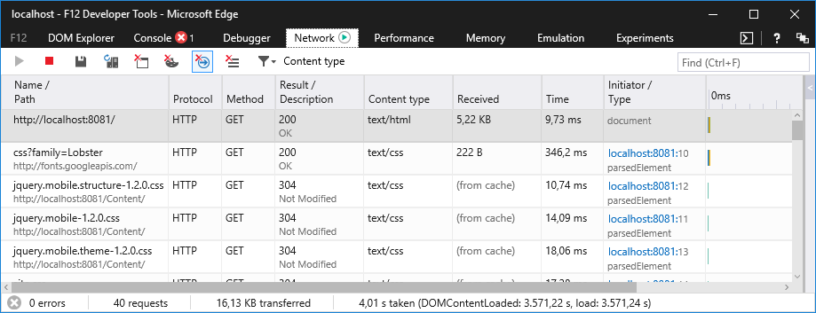

- **UI Responsiveness**

	A partir da análise de rede, podemos detectar possíveis gargalos no acesso ao nosso site. O próximo passo é identificar quais são as causas desta lentidção. Para isso, o IE disponibiliza a ferramente que permite avaliar a responsividade da interface.

	Ao abrir a aba UI Responsiveness, você verá que há um link que ao ser clicado iniciará a análise de responsividade do seu site (acessível também pela tecla Ctrl+E). Seguem os passos para usar esse recurso:

	1. Acessar a página que deseja testar.
	2. Abrir a ferramenta do desenvolvedor.
	3. Acessar a aba UI Responsiveness
	4. Clicar no link para iniciar a análise.
	5. Usar os recursos do site normalmente, inclusive a navegação entre páginas.
	6. Quando terminar, clicar novamente no link para interromper a análise.
	7. Será fornecido o resultado indicando tempo de carga, execução de Javascript, tempo com desenhos gráficos e estilos e também decodificação de imagens. 

	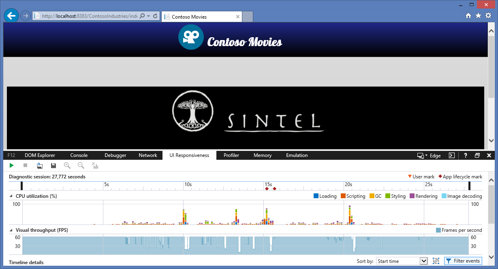

- **Memory**

	Um outro quesito importante a ser analisado nos testes é a memória. Para isso, a ferramenta do desenvolvedor disponibiliza também a aba Memory. E da mesma forma que as abas anteriores, é necessário habilitar o monitoramento para então obter a leitura.

	Ao abrir a aba Memory, habilitar o monitoramento(botão ). É possível tambem obter snapshots durante os testes. Seguem os passos para usar esse recurso:

	1. Acessar a página que deseja testar.
	2. Abrir a ferramenta do desenvolvedor.
	3. Acessar a aba Memory.
	4. Clicar no botão para habilitar o monitoramento de memória.
	5. Usar os recursos do site normalmente, inclusive a navegação entre páginas.
	6. Quando terminar, clicar no botão para interromper o monitoramento de memória.
	7. Será fornecido o resultado indicando informações de execução dos scripts do site.
	
	Nesse caso será mostrado um gráfico indicando o uso de memória pelo browser:
	
	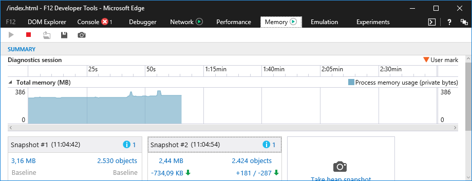

- **Emulation**

	Além de todos os recursos já elencados aqui sobre a ferramenta do desenvolvedor do Internet Explorer, temos ainda a aba de emulação que permite emular a visualização do site em diferentes versões de IE através da definição do Document Mode.
	
	Nessa aba conseguimos visualizar o Document Mode padrão do nosso site (o modo padrão é aquele que foi identificado pelo IE) e definir outro Documento Mode para analisar como nosso site se comporta. É muito útil para testar nosso site em versões anteriores do IE quando não temos essas versões disponíveis em software.
	
	Nessa aba conseguimos também emular:
	- o perfil do Browser entre Desktop, Corporativo (enterprise) e Windows Phone
	- a string do user agent. Especialmente útil para identificar problemas no site relacionados com definição de conteúdo baseado no user agent. 
	- Orientação e Resolução
	- Geolocalização.
	
	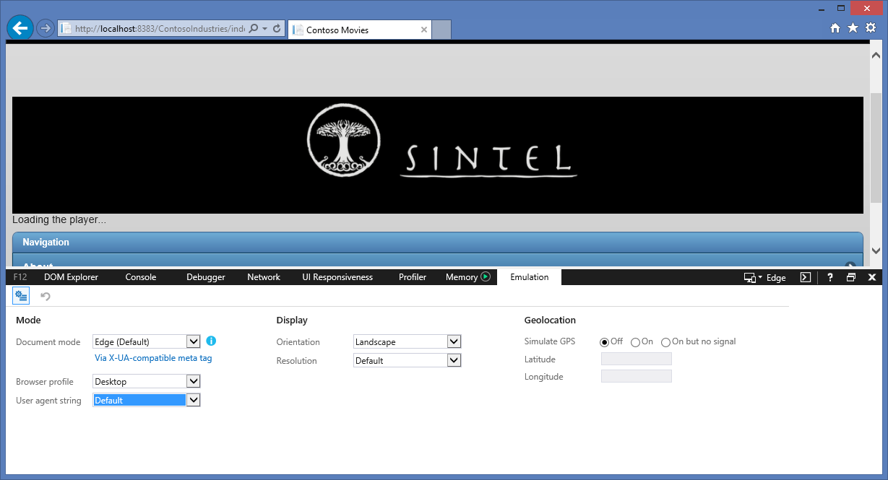

## BrowserStack

A Microsoft firmou parceria com o [BrowserStack](http://www.browserstack.com/) para prover vários browsers para teste interativo através da núvem, independentemente da plataforma. O **BrowserStack** é um serviço online pago mas é possível registrar-se para testá-lo por um período. E mesmo para a assinatura o investimento pode ser justificado com base nas suas necessidades. 

A lista completa de dispostivos e browsers disponíveis para testes podem ser encontrados [aqui](http://www.browserstack.com/list-of-browsers-and-platforms?product=live).

E você pode usar toda essa gama de browsers para testar seu site localmente.

Seguem os passos:

1. Abrir o nosso projeto no **Netbeans** ([código aqui](code/begin)).

1. Executar o projeto localmente.

1. Acessar o [browserstack](http://www.browserstack.com) e efetuar login ou registrar-se para testes fornecendo nome completo, email e senha e clicando em **Sign up for free**.

	> Vamos usar aqui o Chrome, mas é possível usar qualquer browser. As instruções podem ser obtidas [aqui](http://www.browserstack.com/local-testing).

1. Uma vez logado, você verá uma tela listando todos os browsers disponíveis para diferentes plataformas:

	

1. Selecionar a plataforma que desejar e então a versão do browser que quiser testar.

1. Será aberta uma janela com o browser. Insira sua URL (tanto local como remota) para acessar o site.

1. Nesta janela, acessar configurações e então habilitar a opção de resoler URLs locais:

	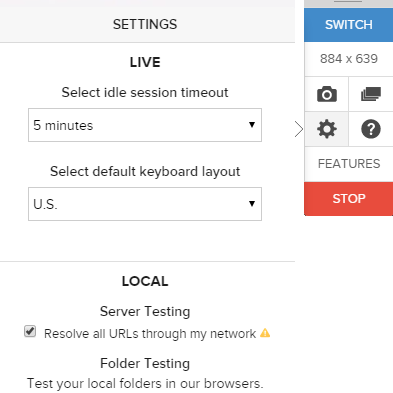  

1. Continue navegando normalmente e testando o funcionamento do seu site no browser. Abaixo segue exemplo usando Internet Explorer 8 no Windows XP

	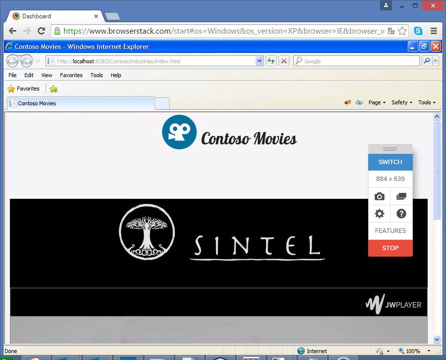

	> Para parar a sessão de testes, basta clicar em "STOP".

1. Exemplo rodando site local no Android:

	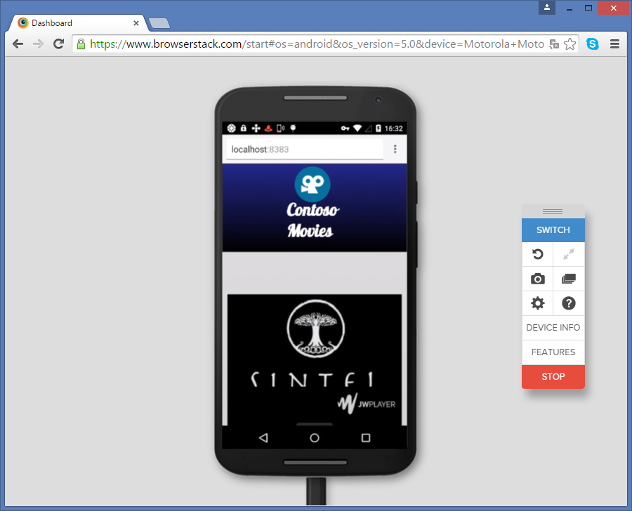

	> Para parar a sessão de testes, basta clicar em "STOP".
	
1. Ao terminar os testes, fazer logout.

> Lembre-se que o tempo do seu plano de testes é em minutos de uso gasto usando quaisquer navegadores disponibilizados. Se você gastar 3 minutos testando seu site no Internet Explorer 8 do Windows XP, você terá 3 minutos mesmo no seu Trial.

##Revisão##

Neste minicurso vimos como podemos realizar testes no nosso site mesmo não tendo equipamentos e browsers disponíveis.

Vimos que a própria Microsoft disponibiliza várias ferramentas que auxiliam na verificação do Site. Além disso, o parceiro Browserstack disponibiliza vários browsers em dispositivos diversos para testar seu site.

Leituras Recomendadas:

1. [Criando sites que simplesmente funcionam.](http://talkitbr.com/2015/08/27/criando-sites-que-simplesmente-funcionam/): Veja como usar detecção de features ao invés de detecção de browsers;
2. [Baixe máquinas virtuais de graça](http://talkitbr.com/2015/09/17/baixe-maquinas-virtuais-de-graca-para-testar-seu-site/): Veja como baixar máquinas virtuais de graça para testar seu site.
3. [Ferramenta do Desenvolvedor](http://talkitbr.com/2015/09/29/aprenda-a-usar-a-ferramenta-do-desenvolvedor-do-browser/): Fique por dentro dos recursos da ferramenta do desenvolvedor fornecida pelo IE.

[Voltar para a página inicial.](http://joaocunhaeld.github.io/interoperable-web-development)