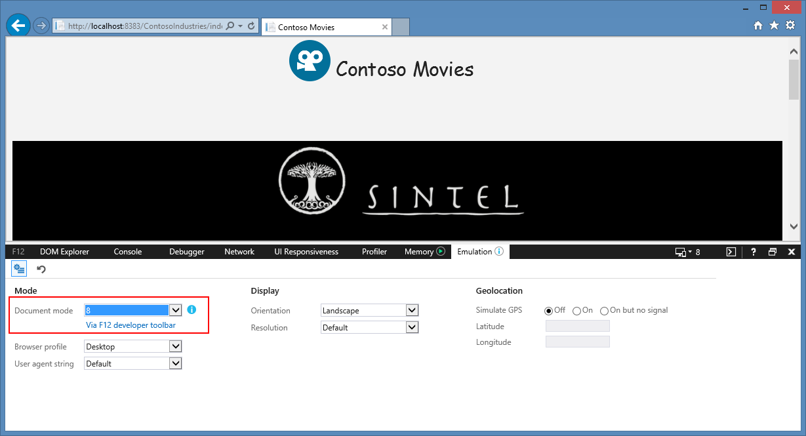
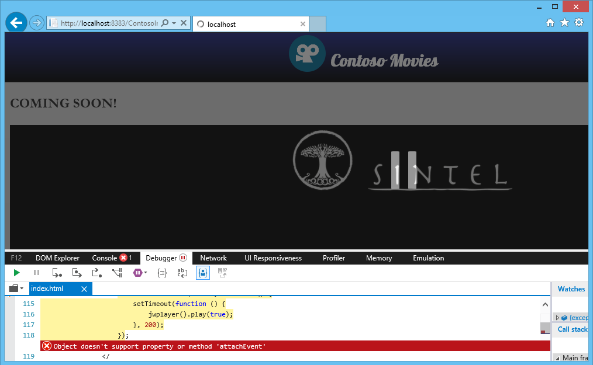
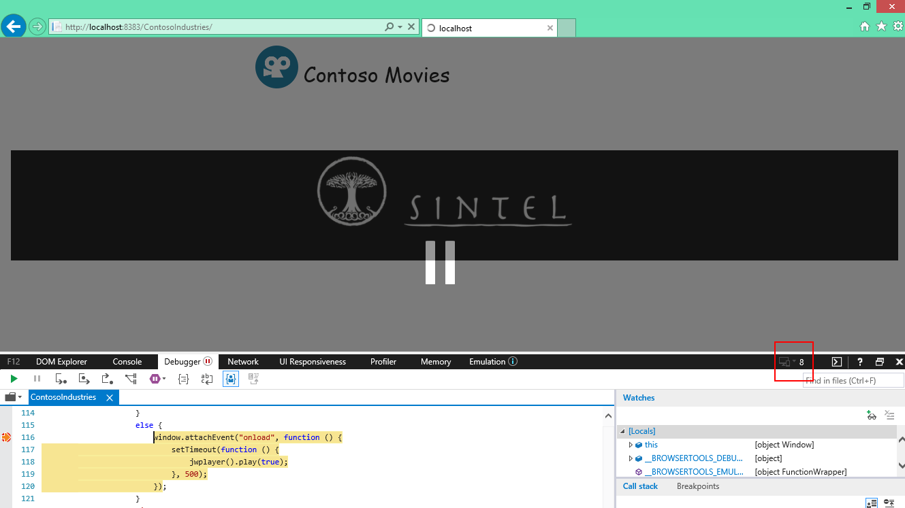
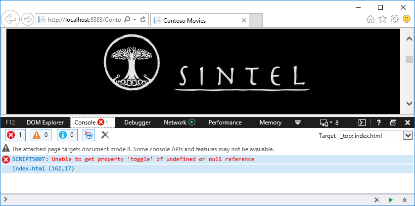
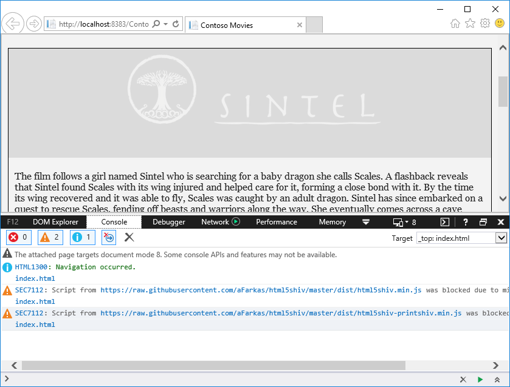
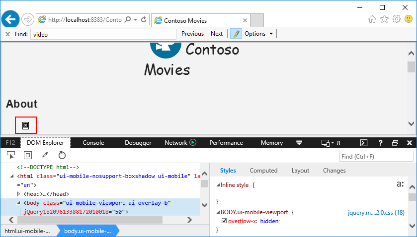
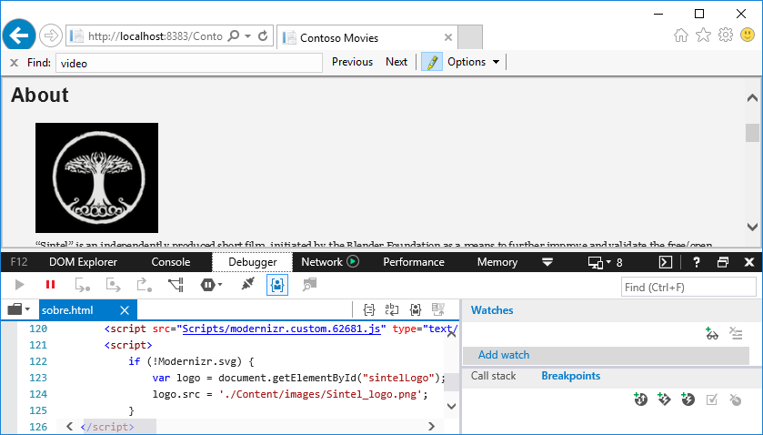
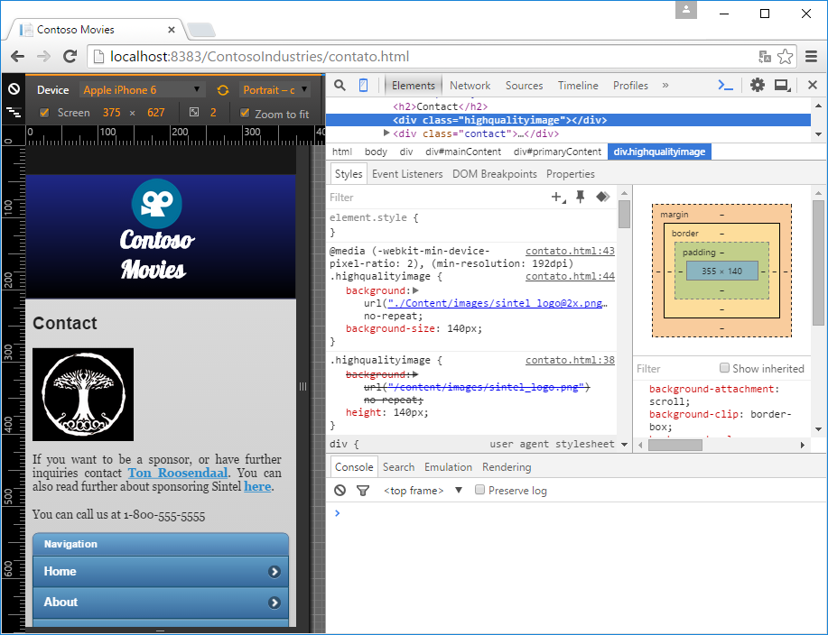
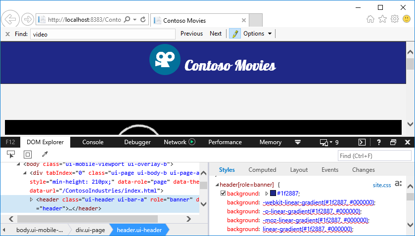

Atualizando seu site e corrigindo problemas
===========================================
Quando desenvolvemos para a Web Moderna, é inevitável que alguns recursos e propriedades que desejamos utilizar não funcionem em browsers antigos. Para contornar este problema, temos que adotar formas de atender a esses browsers priorizando a funcionalidade. Neste caso importa para o usuário conseguir usar a funcionalidade.

Neste contexto, existem algumas propriedades que você pode abrir mão e recursos que você pode substituir por outros que permitem ainda assim que seu site funcione. E a essa estratégia dá-se o nome de *Graceful Degradation*. 

Neste minicurso veremos como atualizar nosso site para suportar browsers antigos e ainda estar aderente a Web Moderna.

Este minicurso inclui:
1. [Recursos JavaScript](#Task1)
1. [Marcação de Vídeo](#Task2)
1. [Animações CSS](#Task3)
1. [Imagens SVG](#Task4)
1. [Imagens @2X](#Task5)
1. [Propriedades CSS3](#Task6)
1. [Elementos HTML5](#Task7)

Neste minicurso iremos usar técnicas vistas nos minicursos anteriores, como o de [Feature Detection](../feature-detection) e [Prefixos CSS](../css-prefix) para corrigir problemas que identificamos ao [testar nosso site em diferentes browsers](../testing).

Podemos usar a Ferramenta do Desenvolvedor (F12) do Internet Explorer para emular versões anteriores do IE, como o IE8. Seguem os passos para isso:

1. Abrir o projeto [Contoso Industries](code/begin) no **NetBeans**
1. Executar o projeto e abrir a página inicial no Internet Explroer.
1. Abrir a Ferramenta do Desenvolvedor pressionando a tecla F12.
1. Abrir a aba do Emulador (Emulation) e modar o **Document mode** para **8**.
	
	

	_Mudando o Document Mode para IE8_

1. O site será recarregado pelo browser emulando o IE8. 

	> Não feche a Ferramenta do Desenvolvedor. Ao fazê-lo, essa configuração será desfeita e o site volatrá a ser exibido no Document Mode padrão.

> Nas versões mais recentes do IE11, mesmo usando emulação para IE8, alguns erros e limitações são contornados pelo browser, o que pode prejudicar nosso trabalho.

Mas sugere-se baixar a máquina virtual contendo o Internet Explorer que iremos utilizar, no caso o IE8 (acessar site [https://dev.modern.ie/tools/vms/windows/](https://dev.modern.ie/tools/vms/windows/)). Para ver como, acesse artigo sobre [como baixar máquinas virtuais gratuitamente para testar seu site](http://talkitbr.com/2015/09/17/baixe-maquinas-virtuais-de-graca-para-testar-seu-site/). 

<p name="Task1" />
#### Recursos Javascript ####
Primeiramente vamos procurar problemas relativos ao Javascript e HTML5 que não são suportados pelo IE8.

Ao executarmos a página inicial, já iremos nos deparar com um primeiro problema de visualização no IE8: o uso da função `attachEvent`. 

> A função attachEvent era usada para definir código a ser executado quando ocorria um determinado evento. O attachEvent, tornou-se obsoleto e foi totalmente removido do IE11. Além disso ele não existe em nenhum dos browsers modernos, como Microsoft Edge e Google Chrome.  



> Esse é um exemplo clássico de problema Javascript quando estamos atualizando sites. A função `attachEvent` foi substituida pela função `addEventListener` nas novas versões do Javascript. Mas é muito comum encontrar o `attachEvent` nas páginas Web antigas ou que foram desenvolvidas para versões anteriores do Internet Explorer. Porém, se usamos um browser moderno ou a nova versão do IE11, o código Javascript simplesmente falha ao tentar executar a função `attachEvent`.

Para corrigir, devemos alterar o código Javascript para verificar se a função `attachEvent` está disponível. Na página `index.html`, vamos alterar o código da tag script localizado no final da tag `div` com id `mainContent`:

	````Javascript
	<script>
		if (window.addEventListener) {
            window.addEventListener("load", function () {
                setTimeout(function () {
                    jwplayer().play(true);
                }, 500);
            });
        }
        else {
            window.attachEvent("onload", function () {
                setTimeout(function () {
                    jwplayer().play(true);
                }, 500);
            });
        }
	</script>
	````	

Dessa forma, conseguiremos obter o resultado esperado em todos os casos, mesmo quando o usuário estiver usando um browser anterior do Internet Explorer que implementa somente a função `attachEvent`.



> Observe que o código de `attachEvent` foi executado quando definimos o Document Mode para IE8.

Ainda em relação ao `addEventListener`, temos outros trechos de código que são usam ele e não o `attachEvent` e podemos cair no mesmo problema citado acima. Para tanto, vamos corrigir o script da seguinte maneira:  

	<!-- mark:2,6-11 -->
	````JavaScript
        <script>
            if (window.addEventListener) {
                window.addEventListener("mobileinit", function () {
                    $.mobile.ajaxEnabled = false;
                });
            } else if (window.attachEvent) {
                window.attachEvent("mobileinit", function () {
                    $.mobile.ajaxEnabled = false;
                });
            }
        </script>
	````
> Novamente, adicionamos a condição para verificar se o `addEventListener` é suportado antes de usá-lo. Caso não seja suportado, então usamos a função antiga `attachEvent` para registrar o manipulador de evento.

<strong>Vamos também fazer a alteração acima em todas as páginas html do nosso site em que houver o uso do `addEventListener`:</strong>

- contato.html
- postcard.html
- sobre.html

<p name="Task2" />
##Marcação de Vídeo

Até agora está funcionando o nosso vídeo. Mas estamos usando biblioteca Javascript para executá-lo. O ideal, porém, é usarmos a tag `<video>` do HTML5. Essa tag permite incluir um vídeo na nossa página sem precisar usar o javascript.

Para a nossa página `index.html`, vamos fazer a seguinte alteração:

- **De:** 
  
	````Javascript
	<div id="myElement">Loading the player...</div>
	
	<script type="text/javascript">
	    jwplayer("myElement").setup({
	        file: "http://wams.edgesuite.net/media/SintelTrailer_MP4_from_WAME/sintel_trailer-1080p_3400.mp4",
	        width: "100%",
	        aspectratio: "16:9",
	        primary: "flash"
	    });
	</script>
	````	

- **Para:** 
  
	````Javascript
    <video id="promoVideo" width="100%" controls src="http://wams.edgesuite.net/media/SintelTrailer_MP4_from_WAME/sintel_trailer-1080p_3400.mp4" autoplay>
        <div id="myElement">Loading the player...</div>
        <script type="text/javascript">
            jwplayer("myElement").setup({
                file: "http://wams.edgesuite.net/media/SintelTrailer_MP4_from_WAME/sintel_trailer-1080p_3400.mp4",
                width: "100%",
                aspectratio: "16:9",
                primary: "flash"
            });
        </script>
    </video>
	````

> O HTML que incluímos na tag vídeo permite especificar o que será exibido pelo browser caso este não suporte a tag `<video>`.

1. Vamos tentar agora rodar nosso site de novo. Quando abrimos a página no IE8, observe que será carregado o jwplayer. Agora, quando abrimos usando Edge ou Chrome, será exibido o vídeo usando o próprio recurso do browser.

<p name="Task3" />
##Animações CSS

Lista de classes, ou class list, permite especificar mais de uma classe para um determinado elemento e fazer a troca de classes usando a função toggle. É muito usado na web moderna, porém ele não é suportado em browsers antigos.

Portanto, temos que estar atentos a isso e tratar adequadamente o class list no caso do usuário estar utilizando um browser antigo.

1. Em index.html, vamos alterar o código que mostra o logo e título do vídeo:

	- De:
	
	<div>
        <div id="movietitle">
            
            
        </div>
    </div>

	- Para:
	
	<div class="wrapper">        
        <div>
            <div id="movietitle">
                
                
            </div>
        </div>
        <div id="synopsis">
            <p>The film follows a girl named Sintel who is searching for a baby dragon she calls Scales. A flashback reveals that Sintel found Scales with its wing injured and helped care for it, forming a close bond with it. By the time its wing recovered and it was able to fly, Scales was caught by an adult dragon. Sintel has since embarked on a quest to rescue Scales, fending off beasts and warriors along the way. She eventually comes across a cave housing an adult and baby dragon, the latter of which she believes to be Scales. The adult dragon discovers and attacks Sintel, but hesitates to kill her. Sintel slays the dragon, only to recognize the scar on its wing and realize the dragon is an adult Scales, and that she too has aged considerably. Sintel leaves the cave heartbroken, unknowingly followed by Scales's baby.</p>
        </div>
    </div>

2. Depois disso, vamos incluir um script que faz uso do class list para alterar a visualização do conteúdo. Incluir o script no final da marcação body, mas antes de fechá-la:

	````Javascript
    <script>
        var wrapper = document.querySelector(".wrapper");
        wrapper.onclick = function () {
            wrapper.classList.toggle("animation");
        };
    </script>
	````

Se executarmos o site no Internet Explorer 11, Microsoft Edge ou Google Chrome, ao clicarmos no título da imagem, uma animação deverá ocorrer.

Mas se executarmos o mesmo site no IE8 (através do emulador ou baixando a máquina virtual com o IE8) veremos que dará um erro e a funcionalidade que desejamos ter no site simplesmente não funcionará.



Para resolver este problema, devemos verificar se o recurso de animação CSS é suportado pelo browser. Para tanto, usamos o mesmo Modernizr (já tratado no minicurso de feature-detection). Vamos então substituir o script acima para:

	````Javascript
    <script>
	     var wrapper = document.querySelector(".wrapper");
	     if (Modernizr.cssanimations) {
	          wrapper.onclick = function () {
	                wrapper.classList.toggle("animation");
	          };
	     } else {
	          wrapper.onclick = function () {
	                var synopsis = document.getElementById("synopsis");
	                var title = document.getElementById("movietitle");
	                if (synopsis.style.display != "block") {
	                     synopsis.style.left = "0px";
	                     synopsis.style.display = "block";
	                     title.style.filter = "progid:DXImageTransform.Microsoft.Alpha(Opacity=10)";
	                } else {
	                     synopsis.style.display = "none";
	                     title.style.filter = "progid:DXImageTransform.Microsoft.Alpha(Opacity=100)";
	                }
	          };
	     }
	</script>
	````

	> No caso acima, quando o recurso de css animation não está disponível, tratamos o clique do conteúdo do título exibindo as informações diretamente, sem animação. Apesar de não ter o mesmo efeito disponível nos browsers modernos, pelo menos não privamos o usuário do conteúdo.  

Feito isso, ao executarmos de novo o site no IE8, veremos agora o conteúdo ao clicarmos no título ou logo do vídeo:



<p name="Task4" />
#### Imagens SVG ####
[SVG](http://www.w3schools.com/svg/svg_intro.asp) (Scalable Vector Graphics) é uma imagem no formato de vertor para gráficos bidimensionais com suporte a interatividade e animação. As imagens SVG são escaláveis e não perdem qualidade quando é feito zoom ou redimensionamento. Como são definidas através de XML, elas podem ser criadas e editadas por qualquer editor de texto. Essas vantagens assim como aderência a padrões tornem o SVG uma alternativa atrativa. Contudo, a falta de suporte pelos browsers limitou seu uso na Web. Uma forma de contornar esta limitação é fornecer, para esses browsers que não suportam XVG, imagens equivalentes mas com formato tradicional.

Vamos ver agora como fazer isso:

1. Abrir a página sobre.html.
2. Observe que temos o seguinte código na página:

	

3. Quando tentamos visualizar essa página emulando o IE8, veja que o logo não é mostrado.
                    
	

4. Para corrigir isso, vamos usar o Modernizr para verificar se o SVG é suportado ou não. Porém o script que geramos anteriormente não verificar SVG (só incluímos no nosso script Modernizr a verificação de CSS Animations e Opacity).
5. Vamos voltar então para o site mo [Modernizr](http://modernizr.com) e selecionar a nossa build os recursos CSS Animations, opacity e agora o SVG. 
	> Reveja como fazer isso no nosso outro [minicurso de detecção de features](../feature-detection).
	> 
	> Vamos pegar o conteúdo Javascript gerado pelo Modernizr e substituir aquele que já tinhamos adicionado na nossa pasta Script (lembre-se de manter o mesmo nome de arquivo).   
6. Agora vamos incluir o seguitne Javascript no final da nossa página sobre.html (antes de fechar a tag <body>):

	````JavaScript
	<script>
		 if (!Modernizr.svg) {
			  var logo = document.getElementById("sintelLogo");
			  logo.src = './Content/images/Sintel_logo.png';
		 }
	</script>
	````
	
	> Lembrar de incluir também o Javascript do Modernizr.

7. Acessando novamente a página, observe que o logo irá aparecer no IE8.

	

<p name="Task5" />
#### @2X images ####
Com os novos dispositivos e telas de retina, as imagens normalmente tem um aspecto granular e de baixa qualidade. A solução adotada nos sites modernos é adotar duas versões de imagens: uma versão normal e outro "2x" que é muito maior. Esta versão 2x precisa ser exibida somente para dispositivos com tela de retina..

Para detectar dispositivos de retina e então fornecer imagens "2x", podemos usar o media query (iremos ver mais detalhes de media queries no outro [minicurso de design responsivo](../mobile-first-design). 

Neste caso podemos também usar a ferramenta de desenvolvimento (F12) do Google Chrome pois ele permite emular diferentes resoluções de tela (ver mais detaques [aqui](https://developer.chrome.com/devtools/docs/device-mode#screen-emulator)).

1. Abrir o arquivo contato.html.

1. Atualizar a marcação `style` e adicone media query para fornecer imagem de alta resolução::
	
	<!-- mark:14-19 -->
	````CSS
	<style>
		 .contact {
			  padding: 5px 10px 15px 0px;
			  font-family: Georgia;
			  font-size: 16px;
			  text-align: justify;
		 }

		 .highqualityimage {
			  background: url("/content/images/sintel_logo.png") no-repeat;
			  height: 140px;
		 }

		 @@media(-webkit-min-device-pixel-ratio: 2), (min-resolution: 192dpi) {
			  .highqualityimage {
					background: url("./Content/images/sintel_logo@2x.png") no-repeat;
                    background-size: 140px;
			  }
		 }
	</style>
	````

1. Usando o Google Chrome e a ferramenta do desenvolvedor para emular dispositivo de alta resolução, vamos testar nosso site:

	

	> Perceba no código CSS ao lado que a imagem definida para a página é a 2x.

<p name="Task6" />
#### Propriedades CSS3
Muitas vezes precisamos ou queremos usar um recurso CSS que ainda não está disponível em todos  browsers. Ou ainda, está disponível em apenas alguns browsers. Neste caso, quando o recurso ainda não é padrão, podemos usar os chamados prefixos CSS que permitem usar recursos nos diferentes browsers.  

> Nota: Tratamos desse assunto no [minicurso cd prefixos CSS](../css-prefix).

Quando estamos trabalhando no nosso site para suportar browsers antigos, precisamos estar atentos para não causar um efeito indesejado ou até causando um efeito contrário. No nosso exemplo do site Contoso, há um cabeçalho nas páginas que deveria ter uma cor com efeito gradiente indo do azul ao preto. Este gradiente não é mostrado no IE8. Ao contrário, é mostrada somente uma cor chapada. Para corrigir isso vamos ao código:

1. Abrir o arquivo `Content/Site.css`
2.Encontrar a regra CSS do cabeçalho: 

	````CSS
	header[role=banner] {
	    background: linear-gradient(#1f2887, #000000);
	}
	````

1. Atualizar as regras da seguinte maneira:

	````CSS
	header[role=banner] {
	    background: #1f2887;
	    background: -webkit-linear-gradient(#1f2887, #000000);
	    background: -o-linear-gradient(#1f2887, #000000);
	    background: -moz-linear-gradient(#1f2887, #000000);
	    background: linear-gradient(#1f2887, #000000);
	}
	````

	>Nesta regra estamos definindo o background padrão somente caso o gradiente não seja suportado. Lembre-se de especificar o gradiente usando os prefixos, conforme visto no nosso outro minicurso. 

	

	>Para testar usamos o IE9 pois o IE8 não suporta a marcação HTML5 `<header>`. Mas essa limitação será tratada a seguir.

<p name="Task7" />
#### Elementos HTML5
O [HTML5](http://www.w3schools.com/html/html5_intro.asp) introduziu novos elementos HTML. Alguns deles já vimos neste minicurso (imagem SVG, marcação <video>) e vimos como fornecer uma alternativa para browsers antigos. Alguns dos elementos introduzidos são os elementos semânticos _\<header>_, _\<footer>_, _\<article>_ e _\<section>_.

Porém, conforme comentado a pouco, o IE8 não suporta essas marcações. A seguir iremos ver como lidar com essas limitações.

1. Abrir o arquivo `index.html`.
2. Localizar na marcação `<body>` o local onde usamos a marcação `<header>`. Você encontrará este trecho de código:

	<!-- mark:3,15 -->
	````HTML
	    <body>
	        <div data-role="page" data-theme="b">
	            <header data-role="header">
	                <div class="header-container">
	                    
	                    <div class="title">Contoso Movies</div>
	                </div>
	            </header>   
			...
			</div>
	   </body>
	````

	> Como podemos ver, o cabeçalho foi feito usando a marcação HTML5 `header` que não é suportada pelo IE8. 

3. Vamos habilitar o HTML5 via Javascript usando a biblioteca html5shiv. Para tanto, vamos incluir essa biblioteca no `<head>` da nossa página:

	````HTML
		<!--[if lt IE 9]>
		<script src="https://raw.githubusercontent.com/aFarkas/html5shiv/master/dist/html5shiv.min.js"></script>
        <script src="https://raw.githubusercontent.com/aFarkas/html5shiv/master/dist/html5shiv-printshiv.min.js"></script>       
		<![endif]-->
	````

	> Estamos incluindo o _shiv_ usando a condição de que o browser seja IE8 ou anterior. 

	> Lembre-se de adicionar em todas as págians HTML do nosso site que usando a marcação `<head>` 

Pronto! Agora podemos testar novamente nosso site no IE8 para verificar a cor de fundo do cabeçalho.

##Revisão##

Neste minicurso vimos como rever nosso site e garantir que funcionalidades estejam disponíveis para o usuário mesmo quando ele estiver usando browser antigo. Mesmo tendo uma certa degradação, o importante aqui é garantir que o usuário tenha acesso a funcionalidade.
